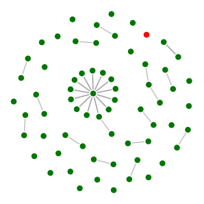

# AwesomeISP

Интерактивная карта коммутаторов, отображаемая в браузере с функцией автообнаружения по LLDP.

Для конечного пользователя это будет выглядеть как простая страница с картой и ничего
более. Одним цветом отображаются устройства которые доступны (отвечают на ping), другим 
цветом те, которые недоступны.

При наведении указателя мыши на какую-то из точек показывается дополнительная
информация: ip-адрес, модель и место расположения.

Сервис в фоновом режиме постоянно сканирует сеть (диапазон ip-адресов задается
в конфиге) и при обнаружении новых устройств добавляет их на карту.

## Как это работает изнутри?

Демон берет из конфига диапазон ip-адресов и методично начинает проверять каждый ip-адрес
путем посылки SNMP-запроса на получение sysName. Если ответ получен, то шлет дополнительные
запросы, что бы определить модель устройства.

Если на предыдущем шаге не удалось определить модель устройства, то считаем что это не коммутатор
и прекращаем "мучать" его.

Если это коммутатор, то добавляем его в БД и спрашиваем у него информацию о соседях (LLDP нам в 
помощь).

Таким образом, имея на руках информацию LLDP с каждого устройства мы может построить карту сети. Тут,
конечно, все упрощено, т.к. в LLDP много тонкостей (распишу позже).

### Состав системы

* discoverer - сервис обнаружения оборудования
* pinger - следит за доступностью оборудования (пингует)
* база данных устройств
* web-интерфес - показывает клиенту карту

## Road map

1. разработка discoverer'а (~ до 09.06.2019)
1. разработка pinger'а (~ до 16.06.2019)
1. разработка web-интерфейса (~ до 20.06.2019)
1. "шлифовка" документации и упаковка в Docker (~ до 23.06.2019)
 